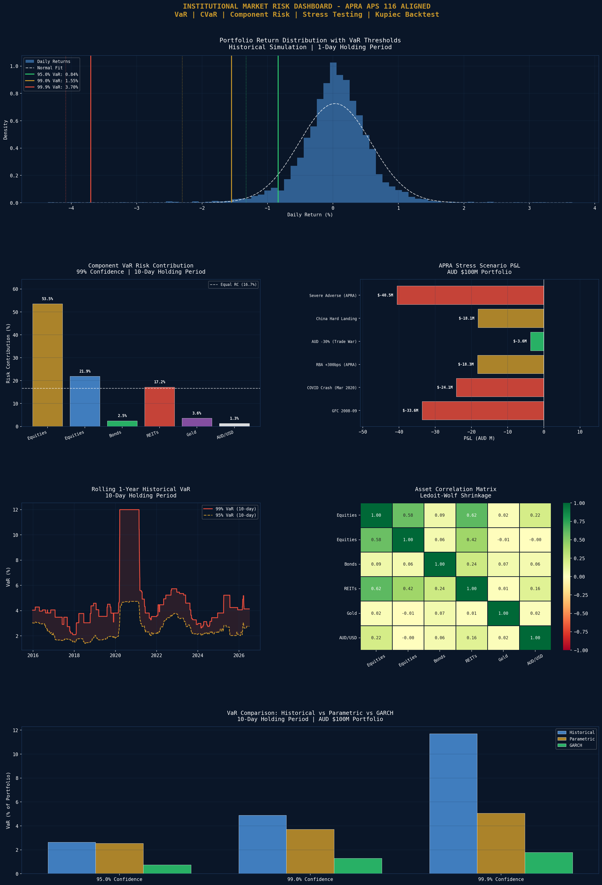

# Institutional Market Risk Dashboard - APRA APS 116 Aligned

A production-grade market risk management system for a AUD $100M multi-asset Australian portfolio, implementing three VaR methodologies (Historical Simulation, Parametric, GARCH-filtered), Component VaR risk attribution, Kupiec backtesting, and six APRA-style macro stress scenarios. Built to the standards of APRA APS 116 capital requirements for Australian ADIs.

## Portfolio Composition
| Asset | Weight |
|---|---|
| ASX 200 Equities | 35.0% |
| Global Equities | 20.0% |
| AGS Bonds | 20.0% |
| ASX REITs | 10.0% |
| Gold | 10.0% |
| AUD/USD | 5.0% |

**AUM:** AUD $100M | **Annual Volatility:** 8.70% | **Holding Period:** 10 days (APRA standard)

## VaR & CVaR Summary (10-Day)
| Confidence | Hist VaR | Hist CVaR | Parametric VaR | GARCH VaR |
|---|---|---|---|---|
| 95.0% | 2.65% | 4.21% | 2.54% | 0.75% |
| 99.0% | 4.90% | 7.29% | 3.72% | 1.30% |
| 99.9% | 11.71% | 12.93% | 5.05% | 1.78% |

## VaR in Dollar Terms (10-Day, 99%)
| Method | VaR |
|---|---|
| Historical VaR | AUD 4.90M |
| Historical CVaR | AUD 7.29M |
| Parametric VaR | AUD 3.72M |
| GARCH VaR | AUD 1.30M |

## APRA Stress Scenario Results
| Scenario | P&L | Return |
|---|---|---|
| GFC 2008-09 | -AUD 33.6M | -33.6% |
| COVID Crash (Mar 2020) | -AUD 24.1M | -24.1% |
| RBA +300bps (APRA) | -AUD 18.3M | -18.3% |
| AUD -30% (Trade War) | -AUD 3.6M | -3.6% |
| China Hard Landing | -AUD 18.1M | -18.1% |
| Severe Adverse (APRA) | -AUD 40.5M | -40.6% |

## Kupiec Backtest Results
| Confidence | Method | Violations | Days | Result |
|---|---|---|---|---|
| 95% | Historical | 150 | 2,997 | PASS |
| 95% | Parametric | 133 | 2,997 | PASS |
| 99% | Historical | 30 | 2,997 | PASS |
| 99% | Parametric | 55 | 2,997 | FAIL |

## Component VaR Risk Attribution (99%, 10-Day)
| Asset | Risk Contribution |
|---|---|
| ASX 200 Equities | 53.5% |
| Global Equities | 21.9% |
| ASX REITs | 17.2% |
| Gold | 3.6% |
| AGS Bonds | 2.5% |
| AUD/USD | 1.3% |

## Key Findings
- **Historical CVaR of AUD 7.29M (7.29%)** at 99% confidence represents the expected loss in the worst 1% of scenarios — this is the key APRA regulatory capital metric under APS 116
- **Parametric VaR fails Kupiec test at 99%** (55 violations vs 30 expected) — confirming that normality assumptions underestimate tail risk for this portfolio, validating the use of historical simulation for regulatory reporting
- **ASX 200 Equities contribute 53.5% of portfolio risk** despite only 35% weight — reflecting equities' higher volatility and positive correlation with REITs, creating risk concentration
- **Severe Adverse APRA scenario: -AUD 40.5M (-40.6%)** — a GFC-plus scenario that would breach most institutional loss limits; this drives the capital adequacy calculation under APRA's Internal Models Approach
- **AUD -30% scenario causes only -3.6% loss** — the portfolio's 20% global equities allocation partially offsets AUD weakness since offshore assets appreciate in AUD terms when AUD falls
- **GARCH VaR significantly lower than Historical** — GARCH forecasts current (low) volatility regime, while historical captures fat tails from 2020 COVID crash; APRA requires the more conservative estimate

## Visualisations

## Tools & Libraries
- Python 3
- arch (GARCH modelling)
- scikit-learn (Ledoit-Wolf covariance)
- scipy (Kupiec test, normal distribution)
- yfinance
- pandas / numpy
- matplotlib / seaborn

## Files
- `Project_17_Market_Risk_Dashboard.ipynb` - Full Colab notebook
- `asx_market_risk.png` - Risk dashboard

## Key Concepts Demonstrated
- Historical Simulation VaR and CVaR
- Parametric (variance-covariance) VaR with normal assumption
- GARCH(1,1) filtered VaR for dynamic volatility
- Component VaR and marginal risk contribution
- Ledoit-Wolf covariance shrinkage
- Kupiec (1995) Proportion of Failures backtest
- APRA APS 116 stress scenarios (GFC, COVID, RBA shock, China landing)
- 10-day square-root-of-time scaling for regulatory holding period
- Rolling VaR for time-varying risk monitoring

## Relevance to Australian Finance Industry
CBA, NAB, Westpac, ANZ, and Macquarie all maintain APRA APS 116 compliant VaR models as a regulatory requirement. Market risk teams at these institutions run identical workflows — historical simulation, parametric VaR, GARCH-filtered estimates, Kupiec backtesting, and APRA stress scenarios — on a daily basis. QIC, Future Fund, and AustralianSuper use equivalent frameworks for investment risk monitoring. This project demonstrates the complete regulatory market risk workflow used by Australian bank treasury and risk management teams.
